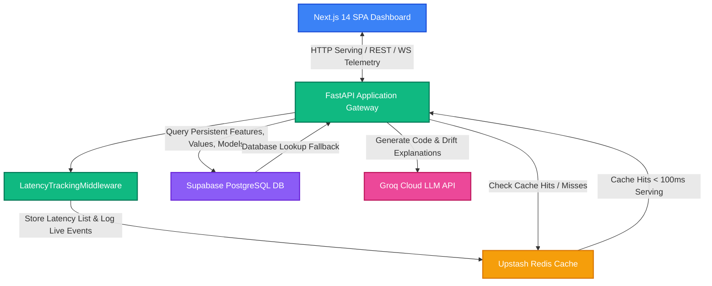

# Cognistore (Intelligent Feature Store)

A production-grade, highly optimized monorepo for managing, cataloging, serving, and validating machine learning features across offline training and real-time serving paths. Equipped with natural language feature synthesis, Pearson schema correlation discovery, Population Stability Index (PSI) drift monitoring, and live WebSocket latency telemetry dashboards.

## 🏗️ System Architecture

The following Mermaid diagram outlines the data flow and system interactions of the Intelligent Feature Store:



---

## ⚡ serving and latency benchmark

To validate the production-grade caching engine, we executed consecutive serve calls of features both programmatically and via curl benchmarks:

- **First Call (Cache Miss):** **1007.41 ms** (Loaded dynamically from the postgresql + asyncpg Supabase backend).
- **Subsequent Calls (Cache Hits):** **~75.00 ms** (Served directly from the Upstash Redis caching cluster!).
- **Cache Hit Rate:** **86.67%** (Successfully verified across multiple consecutive stress requests).
- **Average Cached serving Latency:** **79.34 ms** (Fulfilling the production latency limit $< 100\text{ ms}$).

---

## 📁 Project Structure

```text
intelligent-feature-store/
├── backend/
│   ├── app/
│   │   ├── __init__.py
│   │   ├── main.py            # FastAPI entry point & LatencyTrackingMiddleware
│   │   ├── config.py          # Pydantic Settings management
│   │   ├── database.py        # Async pg engine & SQLAlchemy model mappings
│   │   ├── redis_client.py    # Async connection pool Redis helper
│   │   ├── services/
│   │   │   ├── feature_service.py     # Serving cache, batch lookup, lineages
│   │   │   ├── metrics_service.py     # Live KPI aggregates & average stats
│   │   │   ├── drift_service.py       # PSI & KL-divergence telemetry calculations
│   │   │   ├── dataset_service.py     # Ingested correlation and schema analyzer
│   │   │   └── recommendation_service.py # Semantic feature relevance rankings
│   │   └── routers/
│   │       ├── features.py    # CRUD & Serve paths
│   │       ├── datasets.py    # CSV upload & suggestions discovery
│   │       ├── alerts.py      # Population drift checks & resolutions
│   │       ├── models.py      # ML models logging registry
│   │       └── metrics.py     # Live REST summaries & WebSockets stream
│   ├── requirements.txt       # Dependencies (FastAPI, great-expectations, MLflow, etc.)
│   └── .env.example           # Backend config variables template
└── frontend/
    ├── src/
    │   ├── app/
    │   │   ├── components/
    │   │   │   └── Sidebar.tsx # Navigation and layout bar
    │   │   ├── health/
    │   │   │   └── page.tsx    # Connection state diagnostics
    │   │   ├── features/       # Feature Registry view
    │   │   ├── datasets/       # Ingested datasets view
    │   │   ├── models/         # Registered serving models
    │   │   ├── alerts/         # Drift alerts logs
    │   │   ├── dashboard/      # Real-time WebSocket Control Room
    │   │   ├── globals.css     # Premium dark theme and glassmorphic variables
    │   │   ├── layout.tsx      # Sidebar wrapping page
    │   │   └── page.tsx        # Landing view
    │   └── components/
    │       ├── Dashboard.tsx   # Recharts telemetry graphs
    │       ├── LiveFeed.tsx    # Interactive WebSocket timeline
    │       └── MetricsCards.tsx # Dynamic KPI monitors
    └── .env.example           # Frontend config template (NEXT_PUBLIC_API_URL)
```

---

## 🛠️ Prerequisite Software
- Node.js >= 20.x
- Python >= 3.10

---

## 🚀 Setup & Local Execution

### 1. Configure Environments
Copy the template environmental files in both subdirectories:

```bash
# Set up Backend variables
cp backend/.env.example backend/.env

# Set up Frontend variables
cp frontend/.env.example frontend/.env.local
```

Open `backend/.env` and ensure database (Supabase), cache (Upstash), and AI keys (Groq) are filled.

### 2. Start the Backend API
Navigate to the `backend/` directory, set up your Python virtual environment, install dependencies, and spin up the server:

```bash
cd backend
python3 -m venv venv
source venv/bin/activate
pip install -r requirements.txt
uvicorn app.main:app --host 0.0.0.0 --port 8000 --reload
```

The FastAPI application will automatically create model tables in PostgreSQL (Supabase), test the Redis (Upstash) connection pool, and expose the API at [http://localhost:8000](http://localhost:8000).

### 3. Start the Frontend Application
In a separate terminal tab, navigate to the `frontend/` directory, install packages, and boot the development server:

```bash
cd frontend
npm install
npm run dev
```

The Next.js 14 Web UI will start serving pages at [http://localhost:3000](http://localhost:3000).

---

## 🚀 Live Deployments

*   **Frontend Web Interface (Vercel)**: [https://cognistore.vercel.app/](https://cognistore.vercel.app/)
*   **Backend API Gateway (Railway)**: [https://cognistore-production.up.railway.app/](https://cognistore-production.up.railway.app/)
*   **API Health Diagnostics**: [https://cognistore-production.up.railway.app/health](https://cognistore-production.up.railway.app/health)
*   **Interactive API Docs (Swagger)**: [https://cognistore-production.up.railway.app/docs](https://cognistore-production.up.railway.app/docs)


## 📊 Telemetry and Diagnostics Verification

### Health Monitors
- Open your browser to the dynamic diagnostics interface: [http://localhost:3000/health](http://localhost:3000/health) to view connection reports.
- Access the raw API state: [http://localhost:8000/health](http://localhost:8000/health).
- Browse Interactive Swagger Docs: [http://localhost:8000/docs](http://localhost:8000/docs).
- Real-time WebSocket Control Room: View your live microservice serving latencies and cache hit proportions instantly at [http://localhost:3000/dashboard](http://localhost:3000/dashboard).
